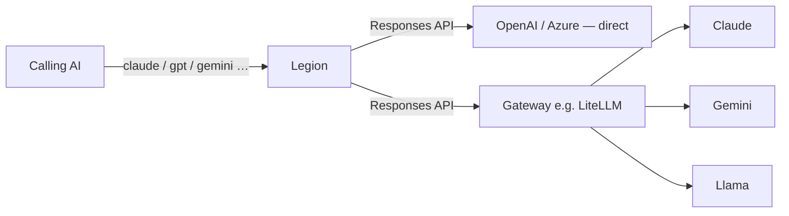

# Legion

> "I am Legion, for we are many."

An [MCP](https://modelcontextprotocol.io) server that exposes LLMs (Claude, GPT, Gemini, Llama, …) as individual tools. Each configured model becomes a tool, named after the model, that the calling AI can invoke to get a second opinion.

Every model is reached through the OpenAI **Responses API** wire format. Endpoints that speak it natively (OpenAI, Azure OpenAI / Foundry) are called directly; anything else routes through an OpenAI-compatible gateway such as a [LiteLLM](https://docs.litellm.ai) proxy. Nothing here depends on any particular gateway.

## How it works



- One tool per model, named after the slugified model name (e.g. `Claude` → `claude`, `GPT 4o` → `gpt_4o`).
- Each tool accepts a `prompt` plus optional `context`, `role`, `system`, `temperature`, and `maxTokens`.
- A `quorum` tool fans one prompt to two or more models and returns each answer as a separate content item. Supports roles via `model:role` selectors (the same model can appear multiple times with different roles), inline ad-hoc `roles`, multi-round discussion (`rounds`, `mode`), and an optional synthesis turn (`synthesize`). The calling AI acts as moderator: feed `structuredContent.transcript` back as `context` with new guidance to steer a live debate.
- Identity and telemetry are returned in `structuredContent`, not embedded in answer text.
- Returns the model's text response; on failure returns an MCP error result the AI can react to.
- Colored, level-gated logging goes to **stderr** (safe for stdio), with a pluggable sink for future DB/API logging.

## Design decisions

- **No provider adapters.** There is no provider-specific code and no built-in model list. Legion speaks one wire format; models that don't speak it natively go through a gateway. Supporting a new model requires no change here.
- **Models are config, not code.** Adding a model means adding a JSON file. The directory is re-read per request, so no rebuild or restart.
- **One tool per model.** Each model appears to the calling AI as its own tool with its own description, rather than a single tool with a model parameter. The `quorum` tool covers the multi-model case.
- **Stateless.** Every call is one-shot with `store: false`. Nothing is persisted, so there is no database and no conversation state to manage.
- **Small.** A few hundred lines of TypeScript, one bundled output file, six dependencies.

## Requirements

- Node.js 24+
- At least one OpenAI-Responses-compatible endpoint (a provider API directly, or a gateway such as LiteLLM for models that need bridging)

## Setup

```pwsh
npm install
copy .env.example .env   # then edit .env
```

## Configuration

All configuration lives in a `config/` directory. The server resolves it in one of two ways:

- **Installed from npm** (or run from any other directory): if a `config/` folder exists in the current working directory, it is used and **overrides all the built-in defaults**. Otherwise the defaults bundled with the package are used. So to customize an npm install, just drop a `config/` folder next to where you run the server — copy the shipped `config/` as a starting point and edit freely.
- **Running from the repo:** the repo's own `config/` folder is the working directory config.

Either way the layout below is identical, and everything hot-reloads per request.

### Models — `config/models/*.json`

Each JSON file becomes a tool, named after the slugified file name (`config/models/fable.json` → tool `fable`):

```json
{
   "model": "claude-fable-5",
   "description": "Claude Fable — fast, creative, general purpose.",
   "baseUrl": "https://api.example.com",
   "apiKey": "sk-optional-per-model-key"
}
```

- `model` (required) — the deployed model id the endpoint routes to.
- `description` — helps the calling AI pick the right model.
- `system` — optional baseline system instructions baked into every call to this model.
- `baseUrl` / `apiKey` — optional; omitted values fall back to `DEFAULT_BASE_URL` / `DEFAULT_API_KEY`.
- `omitParams` — optional list of request params to drop for this model, e.g. `["temperature"]`. The server stays provider-agnostic: it never assumes which models reject which params — you declare each model's quirks here. Useful for reasoning models and some deployments that reject `temperature`.

**Hot-drop:** the directory is re-scanned per request — add or edit a model file and it's live on the next call, no restart.

**Secrets & git:** model files can contain API keys, so `config/models/*.json` is git-ignored. Copy a `*.example.json` (tracked, key-free, ignored by the scanner) to get started:

```pwsh
copy config\models\gpt.example.json config\models\gpt.json   # then add your key
```

### Roles — `config/roles/*.md`

Optional hot-droppable instruction files. Each `.md` file becomes a named role (slugified from filename). Drop a file, it's live on the next call. This repo ships `skeptic.md`, `builder.md`, `judge.md`, and `short.md` (a terse "answer immediately, no deliberation" role useful for constrained-output turns) as ready-to-use starters — edit or delete them freely (they hold no secrets).

Available selectors in tools become `roleName`, e.g. passing `role: "skeptic"` or using `"model:skeptic"` in `quorum.models`.

### AI guidance — `config/description.md`

Optional markdown served to clients as MCP `instructions` — describe your models and when the AI should use each. See this repo's copy for a template.

### Tool, field & message text — `config/*.json` and `config/tools/*.md`

All user-facing text lives in config, not code, and hot-reloads per request:

- `config/tools/<tool>.md` — a tool's description (e.g. `config/tools/quorum.md`). For `quorum`, the live `Available models:` line is always appended automatically. Delete the file to fall back to a built-in string.
- `config/schema.json` — **the source of all input-field descriptions** (no descriptions are hardcoded in the server). Grouped into sections (`prompt` for shared model-tool fields, `quorum` for quorum-only fields) since JSON can't carry comments; flattened into one lookup at load, so a `quorum` key overrides a `prompt` key of the same name. Omit a key and that field simply ships without a description.
- `config/prompts.json` — the **prompt-shaping templates the models actually read**: the role contract wrapper (`roleContract`), the context block (`contextBlock`), the transcript header (`transcriptBlock`), and the quorum round banners (`roundExploring`, `roundFinal`, `synthesis`). Tokens in `{braces}` (`{role}`, `{instructions}`, `{prompt}`, `{context}`, `{transcript}`, `{round}`, `{rounds}`) are filled at runtime. Omit any key or the whole file to use built-in defaults. This is where you tune how strongly roles bind, how context is framed, and how rounds are announced.
- `config/errors.json` — the **runtime error messages** shown to the calling AI: `unknownRole`, `unknownSelector`, `adhocDisabled`, `adhocEmptyName`, `unresolvableSelector`, `modelFailed`. Tokens in `{braces}` (`{role}`, `{available}`, `{selector}`, `{model}`, `{message}`) are filled at runtime. Omit any key or the whole file to use built-in defaults. (Startup/config-validation errors stay in code — a message that reports a broken config file can't live inside it.)

### Environment variables

| Variable | Required | Description |
| --- | --- | --- |
| `DEFAULT_BASE_URL` | no* | API root for models without a `baseUrl` — the SDK appends `/responses`. E.g. `https://api.openai.com/v1`, `https://<res>.openai.azure.com/openai/v1`; a LiteLLM proxy works at its plain root. |
| `DEFAULT_API_KEY` | no* | API key for models without an `apiKey`. Stays server-side. |
| `HOST` | no | HTTP bind address (default `127.0.0.1`). Set `0.0.0.0` to expose — then set `ALLOWED_HOSTS`. |
| `ALLOWED_HOSTS` | no | Comma-separated hostnames for DNS-rebinding protection on non-localhost binds. |
| `PORT` | no | HTTP port (default `5000`; ignored by stdio). |
| `MAX_ROUNDS` | no | Max discussion rounds the `quorum` tool accepts (default `5`). |
| `DYNAMIC_ROLES` | no | Allow the calling AI to define ad-hoc `quorum` roles inline (default `true`). |
| `LOG_LEVEL` | no | `debug` \| `info` \| `warn` \| `error` (default `info`). |

\* Every model must resolve a `baseUrl` and `apiKey` from its file or the defaults — validated at startup.

The server **fails fast** at startup on a missing/empty models directory, invalid model files, an unresolvable endpoint or key, or two file names that slugify to the same tool.

### Routing

Every tool call is a stateless, one-shot Responses API request (`store: false` — nothing is persisted anywhere). Models whose endpoints natively support the Responses API (OpenAI, Azure OpenAI / Foundry) set `baseUrl` (and optionally `apiKey`) to be called **directly**; models that don't (Claude, Gemini, Llama, …) fall back to the defaults — typically an OpenAI-compatible gateway like LiteLLM that bridges Responses to their native APIs. Because nothing multi-turn is used, such a gateway needs **no database** for this workload.

## Logging

- `info` (blue): server start and one metadata line per model call — model, latency, token usage, role, context presence. No prompt/response content.
- `debug` (gray): additionally logs the full prompt and response (context is noted as present, not printed).
- `warn` (orange) / `error` (red): fallbacks and failures.

Color is auto-disabled when stderr is not a TTY.

## Run

One entrypoint, transport as an argument (`stdio` is the default):

Development (no build step, via `tsx`):

```pwsh
npm run dev        # stdio transport
npm run dev:http   # Streamable HTTP transport on :$PORT/mcp
```

Production (compiled to `bin/server.js`):

```pwsh
npm run build
npm start          # node bin/server.js       (stdio)
npm run start:http # node bin/server.js http
```

## Try it

List the tools with the MCP Inspector:

```pwsh
npx @modelcontextprotocol/inspector npx tsx ts/main.ts
```

## Use in VS Code

Add to your `mcp.json`:

```json
{
   "servers": {
      "legion": {
         "command": "node",
         "args": ["bin/server.js"],
         "cwd": "path/to/legion",
         "env": {
            "DEFAULT_BASE_URL": "https://your-gateway.example.com",
            "DEFAULT_API_KEY": "sk-your-key"
         }
      }
   }
}
```

For the HTTP transport, point your client at `http://<host>:<PORT>/mcp`.

## Project layout

```
config/             runtime configuration
   models/*.json     one tool per file (hot-dropped per request)
   roles/*.md        hot-droppable role instruction files
   tools/*.md        optional per-tool descriptions (overridable), e.g. quorum.md
   schema.json       source of all input-field descriptions
   prompts.json      prompt-shaping templates the models read (overridable)
   errors.json       runtime error messages (overridable)
   description.md    MCP instructions for the calling AI
types/index.d.ts    all shared types (global, no import)
ts/                 TypeScript source
   config.ts         env + models/roles loading, validation, slugify
   configText.ts     description/schema/tool-description file loaders
   quorum.ts         quorum engine: speakOne(), runQuorum(), toContext()
   log.ts            level gate + colored console sink (pluggable)
   llm.ts            OpenAI Responses client → prompt() with layered instructions
   server.ts         bootstrap + McpServer factory
   tools.ts          tool schemas + registerModelTools + registerQuorumTool
   main.ts           single entrypoint — compiled to `bin/server.js [stdio|http]`
bin/                compiled output (git-ignored)
```

## Out of scope

Gateway/proxy deployment (LiteLLM or otherwise), hosting infrastructure, MCP client auth, response streaming, and multi-turn conversation state are intentionally not part of this server.
