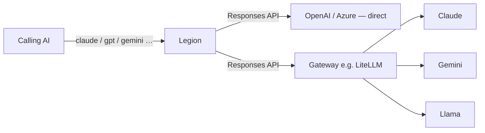

# Legion

> "I am Legion, for we are many."

An [MCP](https://modelcontextprotocol.io)-native model council. Legion exposes
LLMs as individual tools and orchestrates them into debates, juries, blind
panels, private refinement gauntlets, workshops, and custom multi-model
deliberations.

Every model is reached through the OpenAI **Responses API** wire format. Use
OpenAI or Azure directly, route other providers through a compatible gateway
(such as a [LiteLLM](https://docs.litellm.ai) proxy), and configure the entire
council through hot-reloadable files.

## Contents

- [How it works](#how-it-works)
- [Design decisions](#design-decisions)
- [Requirements](#requirements)
- [Setup](#setup)
- [Configuration](#configuration)
- [Logging](#logging)
- [Run](#run)
- [Try it](#try-it)
- [Use in VS Code](#use-in-vs-code)
- [Deploy](#deploy)

## How it works



- **One tool per model**, named after the slugified model name (e.g. `Claude` →
  `claude`). Each accepts a `prompt` plus optional `context`, `role`, `system`,
  `temperature`, and `maxTokens`.
- **A `quorum` tool** fans one prompt out to several models — with roles,
  multi-round discussion, visibility modes, and synthesis — and returns each
  answer separately. See [Presets](#presets--configpresetsjson) for the
  orchestration options.
- **Presets** are named, pre-staffed councils (debate, jury, code review, …),
  each exposed as its own tool.
- Identity and telemetry ride in `structuredContent`, not the answer text.
  Logging goes to **stderr** (safe for stdio).

## Design decisions

- **No provider adapters.** There is no provider-specific code and no built-in
  model list. Legion speaks one wire format; models that don't speak it natively
  go through a gateway. Supporting a new model requires no change here.
- **Models are config, not code.** Adding a model means adding a JSON file. The
  directory is re-read per request, so no rebuild or restart.
- **One tool per model.** Each model appears to the calling AI as its own tool
  with its own description, rather than a single tool with a model parameter.
  The `quorum` tool covers the ad-hoc multi-model case, and each preset in
  `config/presets/` is exposed as its own enforced, pre-staffed council tool.
- **Stateless.** Every call is one-shot with `store: false`. Nothing is
  persisted, so there is no database and no conversation state to manage.
- **Small.** A few hundred lines of TypeScript, one bundled output file, six
  dependencies.

## Requirements

- Node.js 24+
- At least one OpenAI-Responses-compatible endpoint (a provider API directly, or
  a gateway such as LiteLLM for models that need bridging)

## Setup

```pwsh
npm install
copy .env.example .env   # then edit .env
```

## Configuration

All configuration lives in a `config/` directory. The bundled defaults are
**always the base layer**; a `config/` folder in the current working directory
is **overlaid on top of them, per file**:

- **Directory resources** (`models/`, `roles/`, `presets/`, `tools/`): a local
  file overrides the bundled file of the same name; a local-only file is added;
  every bundled file you don't touch stays. So dropping in one
  `config/presets/refine.json` overrides just that preset — the other bundled
  presets remain.
- **Single-file text** (`prompts.json`, `errors.json`, `schema.json`): merged
  **per key** — defaults < bundled < local. A partial local file overrides only
  the keys it sets.
- **`description.md`**: local wins whole if present, else bundled.

The overlay can **override or add**, but not delete a bundled entry. To turn off
bundled presets you don't want, use `DISABLE_PRESETS` (see below).

> **Installing from npm? You must supply your own model files.** The bundled
> config ships only key-free `*.example.json` model files, which the scanner
> deliberately ignores — so the bundle contributes **zero** real models. With no
> real model file the server **fails fast at startup** (`No model files found
> in ...`). Drop one `config/models/<name>.json` next to where you run the
> server (see below) — the rest falls back to the bundled defaults.

The layout below is identical either way, and everything hot-reloads per
request.

### Models — `config/models/*.json`

At least one model file is **required** — the server fails fast without one.
Each JSON file becomes a tool, named after the slugified file name
(`config/models/fable.json` → tool `fable`):

```json
{
   "model": "claude-fable-5",
   "description": "Claude Fable — fast, creative, general purpose.",
   "baseUrl": "https://api.example.com",
   "apiKey": "sk-optional-per-model-key"
}
```

- `model` (required) — the deployed model id the endpoint routes to.
- `description` — helps the calling AI pick the right model.
- `system` — optional baseline system instructions baked into every call to
  this model.
- `baseUrl` / `apiKey` — optional; omitted values fall back to
  `DEFAULT_BASE_URL` / `DEFAULT_API_KEY`.
- `omitParams` — optional list of request params to drop for this model, e.g.
  `["temperature"]`. The server stays provider-agnostic: it never assumes which
  models reject which params — you declare each model's quirks here. Useful for
  reasoning models and some deployments that reject `temperature`.

**Hot-drop:** the directory is re-scanned per request — add or edit a model
file and it's live on the next call, no restart.

**Secrets & git:** model files can contain API keys, so `config/models/*.json`
is git-ignored. Copy a `*.example.json` (tracked, key-free, ignored by the
scanner) to get started:

```pwsh
copy config\models\gpt.example.json config\models\gpt.json   # then add your key
```

### Roles — `config/roles/*.md`

Optional hot-droppable instruction files. Each `.md` file becomes a named role
(slugified from filename). Drop a file, it's live on the next call. This repo
ships `skeptic.md`, `builder.md`, `judge.md`, and `short.md` (a terse "answer
immediately, no deliberation" role useful for constrained-output turns) as
ready-to-use starters — edit or delete them freely (they hold no secrets).

Available selectors in tools become `roleName`, e.g. passing `role: "skeptic"`
or using `"model:skeptic"` in `quorum.models`.

### Presets — `config/presets/*.json`

Optional hot-droppable **council recipes**, one JSON file per preset (named
after the slugified file name, like models). **Each preset becomes its own
tool** — drop `config/presets/code_review.json` and a `code_review` tool appears
on the next request. Each preset has a `description`, a `roles` list, and
optional authoritative `mode` / `synthesizer` defaults. Each role defines its
behavior **inline** — a role's `description` *is* its instructions (the behavior
contract); a role with no `description` falls back to a matching
`config/roles/<role>.md` file:

```json
{
   "description": [
      "Free-for-all: pit several contestants against each other, then crown a winner.",
      "",
      "Staff `contestant` with as many models as you like; one `judge` decides."
   ],
   "mode": "parallel",
   "synthesizer": "judge",
   "roles": [
      { "role": "contestant", "description": "Argue why your answer beats the others.", "min": 2, "max": null },
      { "role": "judge",      "description": "Crown a single winner and justify it.", "min": 1, "max": 1 }
   ]
}
```

The calling AI invokes the preset tool directly (e.g. `code_review`) and still
writes the `models` selectors, assigning any model to any preset role. Presets
are **enforced**: every selector must use a preset role and every role must be
staffed within its cardinality, else the result is an error saying what to fix.

Keys:

- **`description`** (required) — string or array of strings; the preset tool's
  own MCP description.
- **`roles`** — each with optional `description`, and `min`/`max` speakers
  (default exactly one; `max: null` = unbounded, `min: 0` = optional).
- **`mode`, `synthesizer`, `synthesizeEvery`, `framer`, `reframeEvery`,
  `closingStatements`, `eliminateEvery`, `eliminationsOptional`, `enterEvery`,
  `vote`, `voteEvery`, `voteVisibility`, `defaultRounds`** — optional
  orchestration defaults. `framer` is the mirror of `synthesizer`: a neutral
  voice that opens the discussion (and re-steers every `reframeEvery` rounds)
  instead of closing it. Most are overridable per call; `eliminateEvery`
  (survivor mode: the synthesizer removes one speaker every Nth round — a removed
  speaker is out for good and never prompted again), `eliminationsOptional` (let
  the synthesizer keep everyone in a given round), and `enterEvery` (staggered
  entry: with `@team`-tagged selectors, one combatant per team starts and one
  more enters every Nth round) are preset-only. `vote` turns on **anonymous peer
  voting**: every live speaker casts a hidden freeform ballot and only an
  anonymous tally reaches the transcript (advisory — the synthesizer/ref decides
  whether to act on it); `voteEvery`/`voteVisibility` tune it. See a shipped
  preset and the `quorum` tool description for what each does.

This repo ships these presets — edit or delete freely:

<dl>
<dt><code>code_review</code></dt>
<dd>Structured multi-model code review.</dd>
<dt><code>debate</code></dt>
<dd>Opposing sides argue a question to a synthesis.</dd>
<dt><code>brainstorm</code></dt>
<dd>Divergent idea generation across models.</dd>
<dt><code>quick_take</code></dt>
<dd>Fast one-shot reactions from several models.</dd>
<dt><code>tiebreak</code></dt>
<dd>A decisive third voice resolves a stalemate.</dd>
<dt><code>battle_royale</code></dt>
<dd>Free-for-all contest; an overseer crowns a winner.</dd>
<dt><code>jury</code></dt>
<dd>Independent verdicts plus a secret jury ballot the judge weighs.</dd>
<dt><code>election</code></dt>
<dd>Candidates campaign, then the field decides by secret ballot — the anonymous vote is the verdict, not a judge's call. Optional <code>incumbent</code> defends a record; an optional silent <code>electorate</code> reads every round and votes without campaigning.</dd>
<dt><code>double_blind</code></dt>
<dd>Independent blind panel — no one sees the others.</dd>
<dt><code>gauntlet</code></dt>
<dd>Private self-refinement race across rounds.</dd>
<dt><code>refine</code></dt>
<dd>Relay polish of an existing artifact.</dd>
<dt><code>workshop</code></dt>
<dd>Differentiated creative team.</dd>
<dt><code>focus_group</code></dt>
<dd>Moderated panel that riffs off each other.</dd>
<dt><code>final_girl</code></dt>
<dd>Survivors culled one per round until one remains.</dd>
<dt><code>war_games</code></dt>
<dd>A staggered-entry team cage match: <code>@team</code>-tagged combatants enter one at a time while a neutral ref calls fouls and names the winning team, with an optional <code>booker</code> who sets the match.</dd>
</dl>

Empty/missing folder → no preset tools.

> **Role text nudges output, it doesn't cap it** — use `maxTokens` for a hard
> limit, and budget generously for reasoning models and multi-round quorums.

### AI guidance — `config/description.md`

Optional markdown served to clients as MCP `instructions` — describe your
models and when the AI should use each. See this repo's copy for a template.

### Tool, field & message text — `config/*.json` and `config/tools/*.md`

All user-facing text lives in config, not code, and hot-reloads per request.
Each file merges over built-in defaults per key, so override only what you want;
open the shipped copies to see the full key set and `{token}` placeholders:

- `config/tools/<tool>.md` — a tool's description (e.g. `quorum.md`). Delete to
  fall back to the built-in string.
- `config/schema.json` — input-field descriptions (`prompt` = shared fields,
  `quorum` = quorum-only; a `quorum` key wins on a name clash).
- `config/prompts.json` — the prompt-shaping templates models read: role
  contract, context block, transcript header, round banners. Tune how strongly
  roles bind and how rounds are framed here.
- `config/errors.json` — runtime error messages shown to the calling AI.

(Startup/config-validation errors stay in code — a message that reports a broken
config file can't live inside it.)

### Environment variables

| Variable | Required | Description |
| --- | --- | --- |
| `DEFAULT_BASE_URL` | no* | API root for models without a `baseUrl` — the SDK appends `/responses`. E.g. `https://api.openai.com/v1`, `https://<res>.openai.azure.com/openai/v1`; a LiteLLM proxy works at its plain root. |
| `DEFAULT_API_KEY` | no* | API key for models without an `apiKey`. Stays server-side. |
| `HOST` | no | HTTP bind address (default `127.0.0.1`). Set `0.0.0.0` to expose — then set `ALLOWED_HOSTS`. |
| `ALLOWED_HOSTS` | no | Comma-separated hostnames for DNS-rebinding protection on non-localhost binds. |
| `PORT` | no | HTTP port (default `5000`; ignored by stdio). |
| `MAX_ROUNDS` | no | Max discussion rounds the `quorum` tool accepts (default `5`). |
| `TOKEN_BUDGET` | no | Default **soft** cumulative token budget for a `quorum` run (unset = no limit; per-call `tokenBudget` overrides). |
| `DYNAMIC_ROLES` | no | Allow the calling AI to define ad-hoc `quorum` roles inline (default `true`). |
| `DISABLE_PRESETS` | no | Comma-separated preset slugs to **not** register as tools (e.g. `battle_royale,jury`). Applies to bundled and local presets alike; unknown names are ignored. Unset = all presets registered. |
| `LOG_LEVEL` | no | `debug` \| `info` \| `warn` \| `error` (default `info`). |

\* Every model must resolve a `baseUrl` and `apiKey` from its file or the
defaults — validated at startup.

The server **fails fast** at startup on a missing/empty models directory,
invalid model files, an unresolvable endpoint or key, or two file names that
slugify to the same tool.

### Routing

Every tool call is a stateless, one-shot Responses API request. Models whose
endpoints natively speak Responses (OpenAI, Azure OpenAI / Foundry) set a
`baseUrl` to be called **directly**; the rest fall back to the defaults —
typically an OpenAI-compatible gateway like LiteLLM that bridges to their native
APIs.

## Logging

- `info` (blue): server start and one metadata line per model call — model,
  latency, token usage, role, context presence. No prompt/response content.
- `debug` (gray): additionally logs the full prompt and response (context is
  noted as present, not printed).
- `warn` (orange) / `error` (red): fallbacks and failures.

Color is auto-disabled when stderr is not a TTY.

## Run

One entrypoint, transport as an argument (`stdio` is the default):

Development (no build step, via `tsx`):

```pwsh
npm run dev        # stdio transport
npm run dev:http   # Streamable HTTP transport on :$PORT/mcp
```

Production (compiled to `bin/server.js`):

```pwsh
npm run build
npm start          # node bin/server.js       (stdio)
npm run start:http # node bin/server.js http
```

## Try it

List the tools with the MCP Inspector:

```pwsh
npx @modelcontextprotocol/inspector npx tsx ts/server.ts
```

## Use in VS Code

Add to your `mcp.json`:

```json
{
   "servers": {
      "legion": {
         "command": "node",
         "args": ["bin/server.js"],
         "cwd": "path/to/legion",
         "env": {
            "DEFAULT_BASE_URL": "https://your-gateway.example.com",
            "DEFAULT_API_KEY": "sk-your-key"
         }
      }
   }
}
```

For the HTTP transport, point your client at `http://<host>:<PORT>/mcp`.

### Health

- `GET /health` — cheap **liveness**: confirms the process is up and config
  loaded. Returns `{ status: "ok", name, version, models }` (a count). Makes no
  external calls. This is what container `HEALTHCHECK`s and Kubernetes
  liveness/readiness probes should hit.
- `GET /health?deep` — optional **connectivity** check: sends a tiny prompt to
  every model and reports per-model reachability (`503` if any fail). Makes a
  real billable call per model, so use it manually — **don't** wire it to an
  automatic probe.

## Deploy

Ready-to-use container deployment examples (Azure App Service, Azure Container
Apps, Docker Compose, Kubernetes, and Compose + Caddy for HTTPS) live in
[`examples/`](examples/) — each installs Legion from npm and ships a complete
drop-in `config/`.
