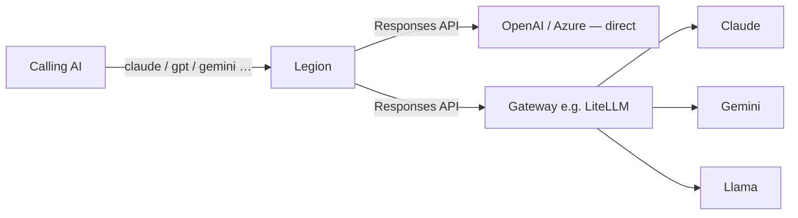

# Legion

> "I am Legion, for we are many."

An [MCP](https://modelcontextprotocol.io)-native model council. Legion exposes
LLMs as individual tools and orchestrates them into debates, juries, blind
panels, private refinement gauntlets, workshops, and custom multi-model
deliberations.

Every model is reached through the OpenAI **Responses API** wire format. Use
OpenAI or Azure directly, route other providers through a compatible gateway
(such as a [LiteLLM](https://docs.litellm.ai) proxy), and configure the entire
council through hot-reloadable files.

## Contents

- [How it works](#how-it-works)
- [Design decisions](#design-decisions)
- [Requirements](#requirements)
- [Setup](#setup)
- [Configuration](#configuration)
- [Logging](#logging)
- [Run](#run)
- [Try it](#try-it)
- [Use in VS Code](#use-in-vs-code)
- [Deploy](#deploy)

## How it works


```mermaid
flowchart LR
   AI[Calling AI] -->|claude / gpt / gemini …| Legion
   Legion -->|Responses API| GPT[OpenAI / Azure — direct]
   Legion -->|Responses API| GW[Gateway e.g. LiteLLM]
   GW --> Claude & Gemini & Llama
```

- **One tool per model**, named after the slugified model name (e.g. `Claude` →
  `claude`). Each accepts a `prompt` plus optional `context`, `role`, `system`,
  `temperature`, and `maxTokens`.
- **A `quorum` tool** fans one prompt out to several models — with roles,
  multi-round discussion, visibility modes, and synthesis — and returns each
  answer separately. See [Presets](#presets--configpresetsjson) for the
  orchestration options.
- **Presets** are named, pre-staffed councils (debate, courtroom, code review, …),
  each exposed as its own tool.
- Identity and telemetry ride in `structuredContent`, not the answer text.
  Logging goes to **stderr** (safe for stdio).

## Design decisions

- **No provider adapters.** There is no provider-specific code and no built-in
  model list. Legion speaks one wire format; models that don't speak it natively
  go through a gateway. Supporting a new model requires no change here.
- **Models are config, not code.** Adding a model means adding a JSON file. The
  directory is re-read per request, so no rebuild or restart.
- **One tool per model.** Each model appears to the calling AI as its own tool
  with its own description, rather than a single tool with a model parameter.
  The `quorum` tool covers the ad-hoc multi-model case, and each preset in
  `config/presets/` is exposed as its own enforced, pre-staffed council tool.
- **Stateless.** Every call is one-shot with `store: false`. Nothing is
  persisted, so there is no database and no conversation state to manage.
- **Small.** A couple thousand lines of TypeScript, one bundled output file, five
  dependencies.

## Requirements

- Node.js 24+
- At least one OpenAI-Responses-compatible endpoint (a provider API directly, or
  a gateway such as LiteLLM for models that need bridging)

## Setup

From npm — no clone, no build:

```pwsh
npx legion-mcp
```

From a clone:

```pwsh
npm install
copy .env.example .env   # then edit .env
```

## Configuration

All configuration lives in a `config/` directory. The bundled defaults are
**always the base layer**; a `config/` folder in the current working directory
is **overlaid on top of them, per file**:

- **Directory resources** (`models/`, `roles/`, `presets/`, `tools/`): a local
  file overrides the bundled file of the same name; a local-only file is added;
  every bundled file you don't touch stays. So dropping in one
  `config/presets/refine.json` overrides just that preset — the other bundled
  presets remain.
- **Single-file text** (`prompts.json`, `errors.json`, `schema.json`): merged
  **per key** — bundled < local. A partial local file overrides only
  the keys it sets.
- **`description.md`**: local wins whole if present, else bundled.

The overlay can **override or add**, but not delete a bundled entry. To choose
which bundled presets register as tools, use `PRESETS` (see below).

> **Installing from npm? You must supply your own model files.** The bundled
> config ships only key-free `*.example.json` model files, which the scanner
> deliberately ignores — so the bundle contributes **zero** real models. With no
> real model file the server **fails fast at startup** (`No model files found
> in ...`). Drop one `config/models/<name>.json` next to where you run the
> server (see below) — the rest falls back to the bundled defaults.

The layout below is identical either way, and everything hot-reloads per
request.

### Models — `config/models/*.json`

At least one model file is **required** — the server fails fast without one.
Each JSON file becomes a tool, named after the slugified file name
(`config/models/fable.json` → tool `fable`):

```json
{
   "model": "claude-fable-5",
   "description": "Claude Fable — fast, creative, general purpose.",
   "baseUrl": "https://api.example.com",
   "apiKey": "sk-optional-per-model-key"
}
```

- `model` (required) — the deployed model id the endpoint routes to.
- `description` — helps the calling AI pick the right model.
- `system` — optional baseline system instructions baked into every call to
  this model.
- `baseUrl` / `apiKey` — optional; omitted values fall back to
  `DEFAULT_BASE_URL` / `DEFAULT_API_KEY`. `apiKey` may reference an environment
  variable with the `env:` prefix — `"apiKey": "env:GPT_KEY"` reads `GPT_KEY`
  from the environment (unset/empty is a fatal startup error), so a key can stay
  out of the file entirely.
- `omitParams` — optional list of request params to drop for this model, e.g.
  `["temperature"]`. The server stays provider-agnostic: it never assumes which
  models reject which params — you declare each model's quirks here. Useful for
  reasoning models and some deployments that reject `temperature`.

**Hot-drop:** the directory is re-scanned per request — add or edit a model
file and it's live on the next call, no restart.

**Secrets & git:** model files can contain API keys, so `config/models/*.json`
is git-ignored. Copy a `*.example.json` (tracked, key-free, ignored by the
scanner) to get started:

```pwsh
copy config\models\gpt.example.json config\models\gpt.json   # then add your key
```

### Roles — `config/roles/*.md`

Optional hot-droppable instruction files. Each `.md` file becomes a named role
(slugified from filename). Drop a file, it's live on the next call. This repo
ships `skeptic.md`, `builder.md`, `judge.md`, and `short.md` (a terse "answer
immediately, no deliberation" role useful for constrained-output turns) as
ready-to-use starters — edit or delete them freely (they hold no secrets).

Available selectors in tools become `roleName`, e.g. passing `role: "skeptic"`
or using `"model:skeptic"` in `quorum.models`.

### Presets — `config/presets/*.json`

Optional hot-droppable **council recipes**, one JSON file per preset (named
after the slugified file name, like models). **Each preset becomes its own
tool** — drop `config/presets/code_review.json` and a `code_review` tool appears
on the next request. Each preset has a `description`, a `roles` list, and
optional authoritative `mode` / `synthesizer` defaults. Each role defines its
behavior **inline** — a role's `description` *is* its instructions (the behavior
contract); a role with no `description` falls back to a matching
`config/roles/<role>.md` file:

```json
{
   "description": [
      "Free-for-all: pit several contestants against each other, then crown a winner.",
      "",
      "Staff `contestant` with as many models as you like; one `judge` decides."
   ],
   "mode": "parallel",
   "synthesizer": "judge",
   "roles": [
      { "role": "contestant", "description": "Argue why your answer beats the others.", "min": 2, "max": null },
      { "role": "judge",      "description": "Crown a single winner and justify it.", "min": 1, "max": 1 }
   ]
}
```

The calling AI invokes the preset tool directly (e.g. `code_review`) and still
writes the `models` selectors, assigning any model to any preset role. Presets
are **enforced**: every selector must use a preset role and every role must be
staffed within its cardinality, else the result is an error saying what to fix.

Keys:

| Key | Type | Default | Description |
| --- | --- | --- | --- |
| `description` | `string \| string[]` | required | MCP description for the preset tool. |
| `roles` | `PresetRole[]` | required | Roles accepted by the preset. |
| `mode` | `"sequential" \| "parallel" \| "private" \| "independent"` | `"sequential"` | Controls which prior turns each round speaker sees. |
| `defaultRounds` | positive integer | `1` | Rounds used when the call omits `rounds`. |
| `synthesizer` | `string` | none | Neutral role that produces synthesis turns. |
| `synthesizeEvery` | `"end" \| non-negative integer` | `"end"` | Runs synthesis at the end or every Nth round. |
| `framer` | `string` | none | Neutral role that opens and redirects the discussion. |
| `reframeEvery` | `"end" \| non-negative integer` | `"end"` | Reframes only at opening or every Nth round after opening. |
| `closingStatements` | `boolean` | `false` | Runs a closing phase before final synthesis. |
| `eliminateEvery` | non-negative integer | `0` | Lets the synthesizer remove one speaker every Nth round. Preset-only. |
| `eliminationsOptional` | `boolean` | `false` | Lets the synthesizer decline an elimination. Preset-only. |
| `enterEvery` | non-negative integer | `0` | Starts one speaker per team, then adds one benched speaker every Nth round. Preset-only. |
| `vote` | `string` | none | Ballot instructions; enables anonymous voting. |
| `voteEvery` | `"end" \| non-negative integer` | `"end"` | Votes at the end or every Nth round. |
| `voteVisibility` | `"aggregate" \| "ballots"` | `"aggregate"` | Includes only totals or also anonymized ballot choices in the transcript. |
| `allowSelfVote` | `boolean` | `true` | Includes each voter's own seat in its candidate menu. |
| `voteByTeam` | `boolean` | `false` | Presents one choice per `@team` and aggregates votes by team. |

Role object keys:

| Key | Type | Default | Description |
| --- | --- | --- | --- |
| `role` | `string` | required | Role name used in `model:role` selectors. |
| `description` | `string \| string[]` | matching role file | Inline instructions; arrays are joined with newlines. Otherwise `config/roles/<role>.md` must exist. |
| `min` | non-negative integer | `1` | Minimum speakers; `0` makes the role optional. |
| `max` | positive integer or `null` | `1` | Maximum speakers; `null` is unbounded. |
| `silent` | `boolean` | `false` | Lets the role observe and vote without speaking in normal rounds. |
| `voter` | `boolean` | all eligible roles | Restricts anonymous ballots to marked roles when any role is marked. |
| `candidate` | `boolean` | all eligible roles | Restricts ballot choices to marked roles when any role is marked. |
| `closing` | `boolean` | all eligible roles | Restricts closings to marked roles; only the first marked speaker per team or unteamed role closes. |
| `closingLast` | `boolean` | `false` | Runs this closer after parallel closings with their statements in context; requires `closing: true`. |
| `tagTeam` | `boolean` | `false` | Rotates one marked speaker per `@team` into each normal round. Cannot combine with `enterEvery`. |
| `cameo` | `boolean` | `false` | Speaks in exactly one round — the call's `cameoRound`, else the midpoint — instead of every round. A run-in, not a regular. |

For example, a courtroom call assigns lawyers to sides with `@team` tags. The
first lawyer listed for each side gives that side's closing statement:

```json
{
   "models": [
      "gpt:lawyer@prosecution",
      "grok:lawyer@prosecution",
      "claude:lawyer@defense",
      "kimi:juror",
      "llama:juror",
      "mistral:juror",
      "opus:judge"
   ],
   "objectives": {
      "prosecution": "Prove liability.",
      "defense": "Defeat liability."
   }
}
```

#### Authoring notes

Things that bite when writing a preset:

- **`min`/`max` count every speaker in that role, not per team.** They bound the
  whole role across all teams, so a tag-team `wrestler` role that must cover
  sides from a 2v2 up to a 6v6 is `min: 4, max: 12` — a 3v3 is just one valid
  staffing (6 wrestlers) inside that range, not its own `max: 3`. The engine
  cannot enforce "even sides" or "one per side" — say it in the `description`
  instead.
- **Neutral roles cannot be teamed.** The `synthesizer` and `framer` reject a
  `@team` tag, so a role that belongs to one side can't hold either job.
- **Some keys require others**, and a violation is caught at load: `synthesizeEvery`
  and `eliminateEvery` need a `synthesizer`, `reframeEvery` needs a `framer`,
  `closingLast` needs `closing`, vote options need `vote`, and a synthesizer
  needs at least one other required role (it stops speaking in normal rounds).
  `enterEvery` and `tagTeam` cannot be combined — both decide who speaks.
- **A malformed preset is skipped, not fatal.** It logs
  `❌ preset skipped — Invalid <file>: <reason>` and every other tool still
  registers, so check the server log when a preset tool doesn't appear.
- **Cost is `speakers × rounds` serial model calls**, so `defaultRounds` and a
  generous `max` multiply quickly. `mode: "parallel"` collapses each round to
  its slowest speaker, at the price of speakers no longer seeing each other
  within a round.

This repo ships these presets — edit or delete freely:

<dl>
<dt><code>battle_royale</code></dt>
<dd>Free-for-all contest; an overseer crowns a winner.</dd>
<dt><code>brainstorm</code></dt>
<dd>Divergent idea generation across models.</dd>
<dt><code>bullying</code></dt>
<dd>One model defends a position while the rest gang up on it; an optional teacher rules on whether it held.</dd>
<dt><code>code_review</code></dt>
<dd>Structured multi-model code review.</dd>
<dt><code>courtroom</code></dt>
<dd>Team-tagged lawyers argue opposing sides, jurors vote by side, and a judge rules.</dd>
<dt><code>debate</code></dt>
<dd>Opposing sides argue a question to a synthesis.</dd>
<dt><code>double_blind</code></dt>
<dd>Independent blind panel — no one sees the others.</dd>
<dt><code>election</code></dt>
<dd>Candidates campaign, then the field decides by secret ballot — the anonymous vote is the verdict, not a judge's call. Optional <code>incumbent</code> defends a record; an optional silent <code>electorate</code> reads every round and votes without campaigning.</dd>
<dt><code>final_girl</code></dt>
<dd>Survivors culled one per round until one remains.</dd>
<dt><code>focus_group</code></dt>
<dd>Moderated panel that riffs off each other.</dd>
<dt><code>gauntlet</code></dt>
<dd>Private self-refinement race across rounds.</dd>
<dt><code>quick_take</code></dt>
<dd>Fast one-shot reactions from several models.</dd>
<dt><code>refine</code></dt>
<dd>Relay polish of an existing artifact.</dd>
<dt><code>tag_team</code></dt>
<dd>Tag team match: one <code>@team</code>-tagged wrestler is legal per team each round and the rest wait on the apron, rotating every round so a three-person side cycles through all three. An optional <code>run_in</code> hits the ring for a single round (book it with <code>cameoRound</code>), an optional <code>announcer</code> calls the match, and the <code>ref</code> names the winning team.</dd>
<dt><code>tiebreak</code></dt>
<dd>A decisive third voice resolves a stalemate.</dd>
<dt><code>war_games</code></dt>
<dd>A staggered-entry team cage match: <code>@team</code>-tagged combatants enter one at a time while a neutral ref calls fouls and names the winning team, with an optional <code>booker</code> who sets the match.</dd>
<dt><code>workshop</code></dt>
<dd>Differentiated creative team.</dd>
</dl>

Which **bundled** presets register as tools is controlled by
[`PRESETS`](#environment-variables) — unset registers them all, and a **local-only**
preset (a slug with no bundled counterpart) you add under your own
`config/presets/` is always registered regardless, since authoring one is the
opt-in. A local file that reuses a bundled slug is a customization of that
preset, not a new one, so it still obeys `PRESETS`. With no bundled presets and
no local presets there are no preset tools — but note the bundled set is the base
layer, so you get every bundled preset even when you ship no `config/presets/`
folder of your own.

> **Role text nudges output, it doesn't cap it** — use `maxTokens` for a hard
> limit, and budget generously for reasoning models and multi-round quorums.

### AI guidance — `config/description.md`

Optional markdown served to clients as MCP `instructions` — describe your
models and when the AI should use each. See this repo's copy for a template.

### Tool, field & message text — `config/*.json` and `config/tools/*.md`

All user-facing text lives in config, not code, and hot-reloads per request.
Each file merges over the bundled JSON base per key, so override only what you want;
open the shipped copies to see the full key set and `{token}` placeholders:

- `config/tools/<tool>.md` — a tool's description (e.g. `quorum.md`). Delete to
  fall back to the built-in string.
- `config/schema.json` — input-field descriptions (`prompt` = shared fields,
  `quorum` = quorum-only; a `quorum` key wins on a name clash).
- `config/prompts.json` — the prompt-shaping templates models read: role
  contract, context block, transcript header, round banners. Tune how strongly
  roles bind and how rounds are framed here.
- `config/errors.json` — runtime error messages shown to the calling AI.

(Startup/config-validation errors stay in code — a message that reports a broken
config file can't live inside it.)

### Environment variables

| Variable | Required | Description |
| --- | --- | --- |
| `DEFAULT_BASE_URL` | no* | API root for models without a `baseUrl` — the SDK appends `/responses`. E.g. `https://api.openai.com/v1`, `https://<res>.openai.azure.com/openai/v1`; a LiteLLM proxy works at its plain root. |
| `DEFAULT_API_KEY` | no* | API key for models without an `apiKey`. Stays server-side. |
| `ALLOW_NO_MODELS` | no | `true` boots even when **no model files exist**: zero model tools; `quorum` and preset tools register but fail on use until a `config/models/*.json` appears (hot-reloaded per request). For demos and registry sandboxes that only list tools. Default `false` — missing models stay fatal. |
| `MCP_TRANSPORT` | no | `http` (default) or `stdio`. |
| `HOST` | no | HTTP bind address (default `127.0.0.1`). Set `0.0.0.0` to expose — then set `ALLOWED_HOSTS`. |
| `ALLOWED_HOSTS` | no | Comma-separated hostnames for DNS-rebinding protection on non-localhost binds. |
| `PORT` | no | HTTP port (default `5000`; ignored by stdio). |
| `MAX_ROUNDS` | no | Max discussion rounds the `quorum` tool accepts (default `5`). |
| `MODEL_TIMEOUT` | no | Per-model-call timeout in ms (default `90000`), so one stalled seat cannot stall a council. Retried once, so a seat's worst case is roughly double before it becomes a failed turn. |
| `TOKEN_BUDGET` | no | Default **soft** cumulative token budget for a `quorum` run (unset = no limit; per-call `tokenBudget` overrides). |
| `DYNAMIC_ROLES` | no | Allow the calling AI to define ad-hoc `quorum` roles inline (default `true`). |
| `PRESETS` | no | Comma-separated **allowlist** of bundled preset slugs to register as tools (e.g. `code_review,debate`). Unset = every bundled preset, so upgrades never silently drop one; set = only these, so a newly shipped bundled preset never appears uninvited. Presets you add under your own `config/presets/` are **always** registered — authoring one is the opt-in — while a local file sharing a bundled slug customizes that preset and still obeys the list. Unknown names are ignored. |
| `LOG_LEVEL` | no | `debug` \| `info` \| `warn` \| `error` (default `info`). |

\* Every model must resolve a `baseUrl` and `apiKey` from its file or the
defaults — validated at startup.

The server **fails fast** at startup on a missing/empty models directory
(unless `ALLOW_NO_MODELS=true`), invalid model files, an unresolvable endpoint
or key, or two file names that slugify to the same tool.

### Routing

Every tool call is a stateless, one-shot Responses API request. Models whose
endpoints natively speak Responses (OpenAI, Azure OpenAI / Foundry) set a
`baseUrl` to be called **directly**; the rest fall back to the defaults —
typically an OpenAI-compatible gateway like LiteLLM that bridges to their native
APIs.

## Logging

- `info` (blue): server start and one metadata line per model call — model,
  latency, token usage, role, context presence. No prompt/response content.
- `debug` (gray): additionally logs the full prompt and response (context is
  noted as present, not printed).
- `warn` (orange) / `error` (red): fallbacks and failures.

Color is auto-disabled when stderr is not a TTY.

## Run

One entrypoint; the transport comes from `MCP_TRANSPORT` (`http` is the
default, set `stdio` for desktop MCP clients).

From npm (`legion-mcp` bin — run from a directory holding your `config/`):

```pwsh
npx legion-mcp                             # Streamable HTTP transport on :$PORT/mcp
$env:MCP_TRANSPORT='stdio'; npx legion-mcp # stdio transport
```

Installed globally or as a dependency, the same binary is on `PATH`:

```pwsh
npm install -g legion-mcp
legion-mcp
```

Development (no build step, via `tsx`):

```pwsh
npm run dev         # Streamable HTTP transport on :$PORT/mcp
npm run dev:stdio   # stdio transport
```

Production (compiled to `bin/server.js`):

```pwsh
npm run build
npm start           # http
npm run start:stdio # stdio
```

## Try it

List the tools with the MCP Inspector:

```pwsh
npx @modelcontextprotocol/inspector -e MCP_TRANSPORT=stdio npx tsx ts/server.ts
```

## Use in VS Code

Add to your `mcp.json` — from npm:

```json
{
   "servers": {
      "legion": {
         "command": "npx",
         "args": ["-y", "legion-mcp"],
         "cwd": "path/to/your/config/parent",
         "env": {
            "MCP_TRANSPORT": "stdio",
            "DEFAULT_BASE_URL": "https://your-gateway.example.com",
            "DEFAULT_API_KEY": "sk-your-key"
         }
      }
   }
}
```

Or from a clone:

```json
{
   "servers": {
      "legion": {
         "command": "node",
         "args": ["bin/server.js"],
         "cwd": "path/to/legion",
         "env": {
            "MCP_TRANSPORT": "stdio",
            "DEFAULT_BASE_URL": "https://your-gateway.example.com",
            "DEFAULT_API_KEY": "sk-your-key"
         }
      }
   }
}
```

For the HTTP transport, point your client at `http://<host>:<PORT>/mcp`.

### Health

- `GET /health` — cheap **liveness**: confirms the process is up and config
  loaded. Returns `{ status: "ok", name, version, models }` (a count). Makes no
  external calls. This is what container `HEALTHCHECK`s and Kubernetes
  liveness/readiness probes should hit.
- `GET /health?deep` — optional **connectivity** check: sends a tiny prompt to
  every model and reports per-model reachability (`503` if any fail). Makes a
  real billable call per model, so use it manually — **don't** wire it to an
  automatic probe.

## Deploy

Ready-to-use container deployment examples (Azure App Service, Azure Container
Apps, Docker Compose, Kubernetes, and Compose + Caddy for HTTPS) live in
[`examples/`](examples/) — each installs Legion from npm and ships a complete
drop-in `config/`.
